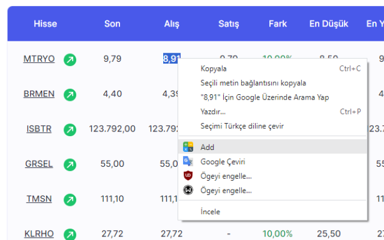
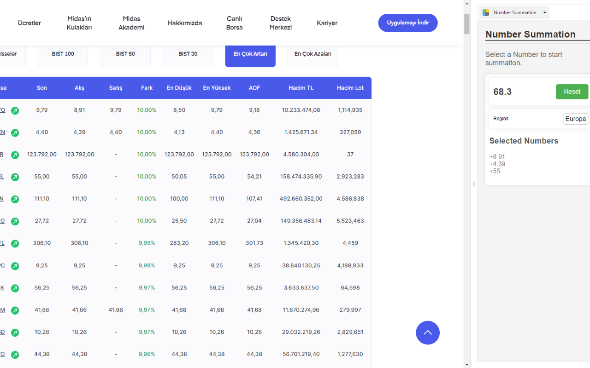

# Number Adder Chrome Extension

## Description

The Number Adder Chrome Extension enables users to quickly perform arithmetic calculations, specifically addition, directly within their Chrome browser. Whether you're totaling expenses, adding up data figures, or simply solving a math problem, this extension offers a seamless and straightforward solution.

## Features

- Highlight numbers and right-click to sum them up
- Sum is displayed in a small, non-intrusive pop-up window
- User-friendly interface
- Quick installation

## Installation

1. Download or clone this repository.
2. Open Chrome and navigate to `chrome://extensions/`.
3. Enable "Developer Mode" in the upper right corner.
4. Click "Load Unpacked" and select the folder where you downloaded or cloned this repository.

## Usage

1. Highlight the numbers you want to add in any web page.
2. Right-click to open the context menu.
3. Click on the "Add Numbers" option.
4. A sidebar window will appear displaying the sum.

## Images

## Requirements

- Google Chrome Browser
- Enabled "Developer Mode" for Chrome Extensions if installing manually

## Contributing

If you'd like to contribute to this project, please fork the repository and make changes as you'd like. Pull requests are warmly welcome.

## License

MIT

## Support

If you encounter any issues, please open an issue on GitHub or contact the maintainers directly.

## Authors

- Sezgin Sevinc(Me)